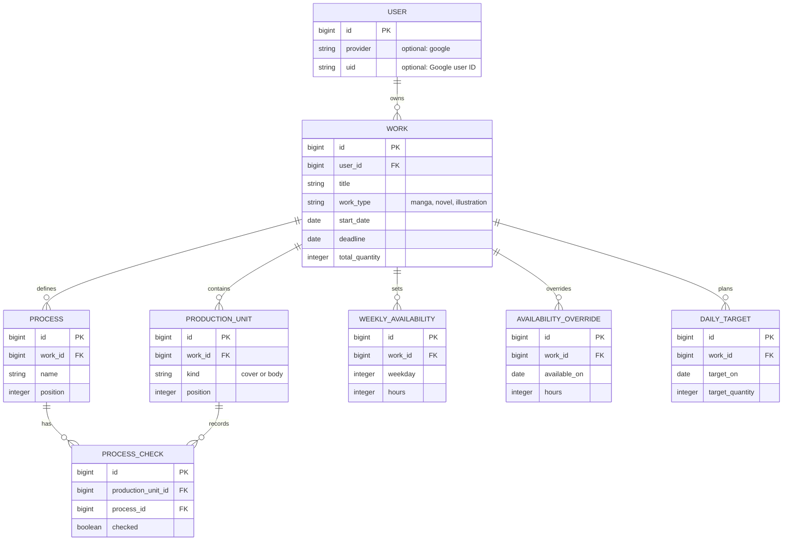

```mermaid
erDiagram
  USER ||--o{ WORK : owns

  WORK ||--o{ PROCESS : defines
  WORK ||--o{ PRODUCTION_UNIT : contains
  PROCESS ||--o{ PROCESS_CHECK : has
  PRODUCTION_UNIT ||--o{ PROCESS_CHECK : records

  WORK ||--o{ WEEKLY_AVAILABILITY : sets
  WORK ||--o{ AVAILABILITY_OVERRIDE : overrides
  WORK ||--o{ DAILY_TARGET : plans

  USER {
    bigint id PK
    string provider "optional: google"
    string uid "optional: Google user ID"
  }

  WORK {
    bigint id PK
    bigint user_id FK
    string title
    string work_type "manga, novel, illustration"
    date start_date
    date deadline
    integer total_quantity
  }

  PROCESS {
    bigint id PK
    bigint work_id FK
    string name
    integer position
  }

  PRODUCTION_UNIT {
    bigint id PK
    bigint work_id FK
    string kind "cover or body"
    integer position
  }

  PROCESS_CHECK {
    bigint id PK
    bigint production_unit_id FK
    bigint process_id FK
    boolean checked
  }

  WEEKLY_AVAILABILITY {
    bigint id PK
    bigint work_id FK
    integer weekday
    integer hours
  }

  AVAILABILITY_OVERRIDE {
    bigint id PK
    bigint work_id FK
    date available_on
    integer hours
  }

  DAILY_TARGET {
    bigint id PK
    bigint work_id FK
    date target_on
    integer target_quantity
  }
```
